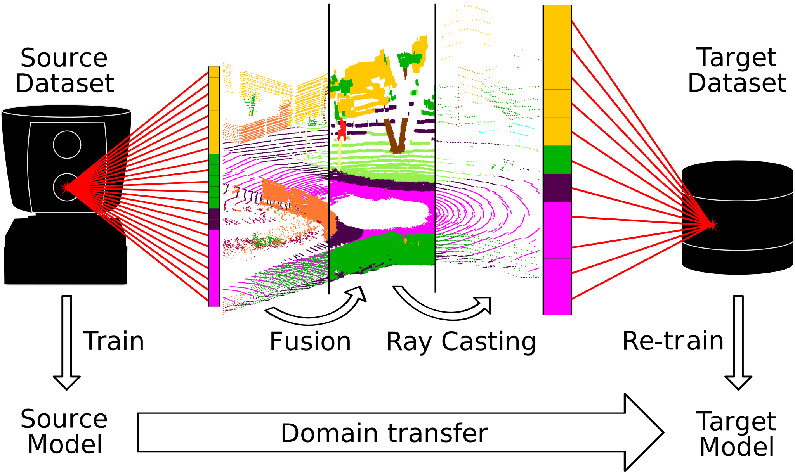

# LiDAR-Transfer

Transfer SemanticKITTI labeles into other dataset/sensor formats.



## Content
- Convert datasets ([NUSCENES](nuscenes2kitty.py), [FORD](ford2kitty.py), [NCLT](nclt2kitty.py)) to KITTI format
- Minimal dataset [minimal.zip](minimal.zip)
- Visualize with [visualizer.py](visualizer.py)
- Transfer datasets [lidar_deform.py](lidar_deform.py)

## Usage
<details>
<summary>Install Dependencies</summary>

```
pip install pyaml pyqt5 scikit-image scipy torchvision

pip install pycuda

pip install vispy
```

Or use local installation to apply antialias patch

```
git clone https://github.com/vispy/vispy.git
cd vispy
git apply ../lidar_transfer/vispy_antialias.patch
pip install -e .
```

</details>

<details>
<summary>Get started</summary>

1. Unzip `minimal.zip`
2. Run 
    ```
    python lidar_deform.py -d minimal
    ```
3. Run with target sensor
    ```
    python lidar_deform.py -d minimal -t minimal/target.yaml
    ```
4. Change parameter in `config/lidar_transfer.yaml`

</details>

## Credits
Developed by Ferdinand Langer, 2019.
This tool uses the following open source software:
- Fast BVH by Brandon Pelfrey https://github.com/brandonpelfrey/Fast-BVH
- TSDF Fusion by Andy Zeng https://github.com/andyzeng/tsdf-fusion-python
- Visualization http://vispy.org/